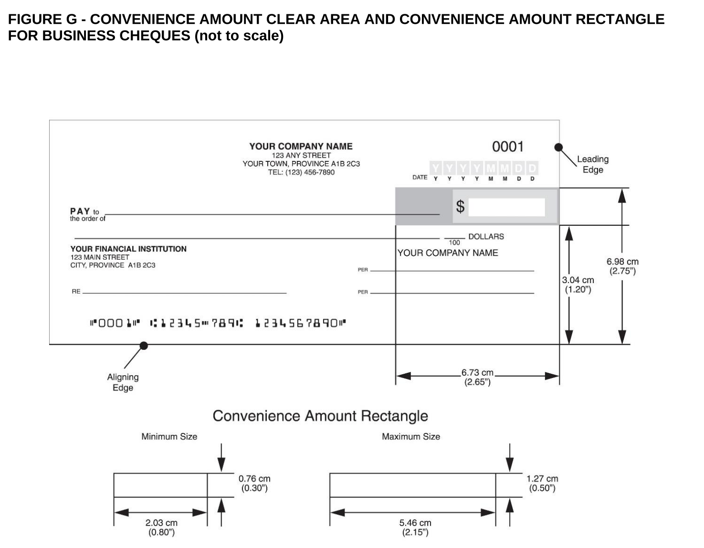

# php-cheque-printer
## WARNING

> ONLY PRODUCE CHEQUES FOR YOUR OWN ACCOUNTS!

### Forgery (Section 366 of the Criminal Code)
#### Making or altering a cheque with intent to defraud.
- Indictable offense: Up to 10 years in prison
- Summary conviction: Lesser penalties such as fines or up to 2 years less a day in jail.

### Uttering a Forged Document (Section 368 of the Criminal Code)
#### Knowingly using a fraudulent cheque.  
- Indictable offense: Up to 10 years in prison
- Summary conviction: Lesser penalties.

### Fraud (Section 380 of the Criminal Code)
#### If the fraud amount exceeds $5,000, it can result in:
- Up to 14 years in prison
- Restitution orders (repayment of defrauded funds)
- A criminal record that can affect future employment and travel.

### Don't do it!

## Background
Welcome to Canada's ancient banking system.

Cheques aren’t as secure as many people assume - anyone with your institution number, transit number, and account number can withdraw funds from your account, the same details used for direct deposits.

Unlike currency paper stock, cheque stock isn’t regulated, meaning anyone can print their own cheques.

If you need to transfer more than $3,000 - $10,000, a cheque is often required unless you're willing to pay around $100 in wire fees on both ends or visit a branch to get a bank draft for about $10.

Going in person and paying extra? No thanks.

By printing your own cheques, you can manage payments for multiple accounts and deposit them using your bank’s mobile app - all without leaving your house.

## Features

### Canada Full Size ✅ 
- Fits amounts up to $9,999,999.99 in legal field. Technically cheque limits in Canada are 25M, but I would use a draft...


### Canada Wallet (untested)


### US Wallet ✅  
Used since at least 2005 according to the original author. https://github.com/aaronpk/checks


## Design

Spec: https://www.payments.ca/sites/default/files/standard006eng.pdf




MICR 


## Installing
### Ubuntu
```bash
sudo apt install php-cli
```

## Running
```bash
php -S 127.0.0.1:8000
```

### Routes
- Canada Full Size
    - http://127.0.0.1:8000
        - uses default json files
    - http://127.0.0.1:8000/?config=ws.json&overrides=albert.json
        - filenames loaded dynamically from URL params
        - create: configs/accounts/ws.json
        - create: configs/overrides/albert.json

- Canada Wallet
    - http://127.0.0.1:8000/can-wallet.php
- US
    - http://127.0.0.1:8000/us.php


## Canadian Cheque Stock
Ensure that the cheque paper you purchase has the Canadian endorsement pre-printed text, not the U.S. version.

As of 2025, the most affordable option I've found is $86 CAD (including shipping) for 500 sheets. With three cheques per sheet, this provides 1,500 cheques—enough to write one cheque per month for 125 years. Even if you use one cheque per sheet, that still covers 41 years of cheques.

Cheque dimensions must be within the following range:
- Minimum size: 6.25" wide × 2.75" high
- Maximum size: 8.5" wide × 3.75" high

The bottom 5/8" of the cheque (MICR Clear Band) must remain free of any printing, except for the magnetic ink numbers and symbols. Any background printing in this area must be extremely light to avoid interference with scanning.

Canadian Cheque ✅  


US Check ❌  


## Depositing
If you have a laser printer and can purchase magnetic (MICR) ink, your cheques will be widely accepted.

Printing with a standard inkjet or laser printer may cause some ATMs to reject them, but they generally function as expected.

Most cheques are processed using optical scanning methods, such as mobile banking deposits via smartphone cameras or internal ATM scanners. Non-magnetic ink typically does not pose an issue. While magnetic ink was historically used to facilitate machine reading of routing and account numbers, it is not a legal requirement for cheques.

The CPA 006 standard, introduced in 2006, standardized cheque formats as banks transitioned from physically exchanging cheques to transmitting their images electronically, paving the way for mobile deposits.

## Contributing
This command tells Git to assume that the specified file has not changed, even if it has. This can be useful for temporarily ignoring changes to a file without modifying .gitignore.

```bash
git update-index --assume-unchanged <file>
```

This command reverses the effect of --assume-unchanged, telling Git to resume tracking changes to the specified file.
```bash
git update-index --no-assume-unchanged <file>
```