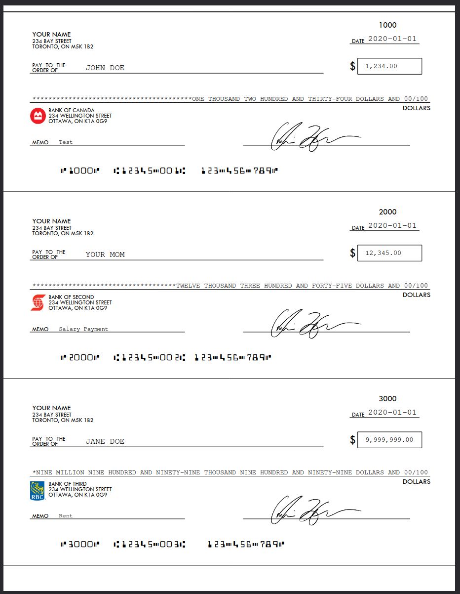
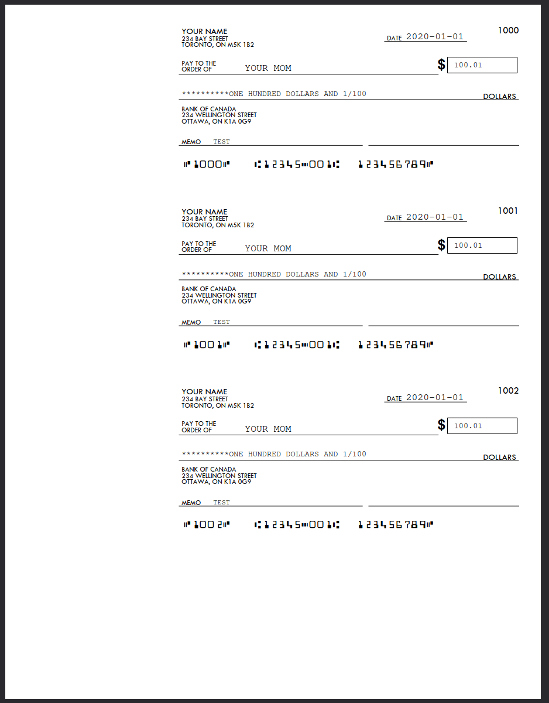
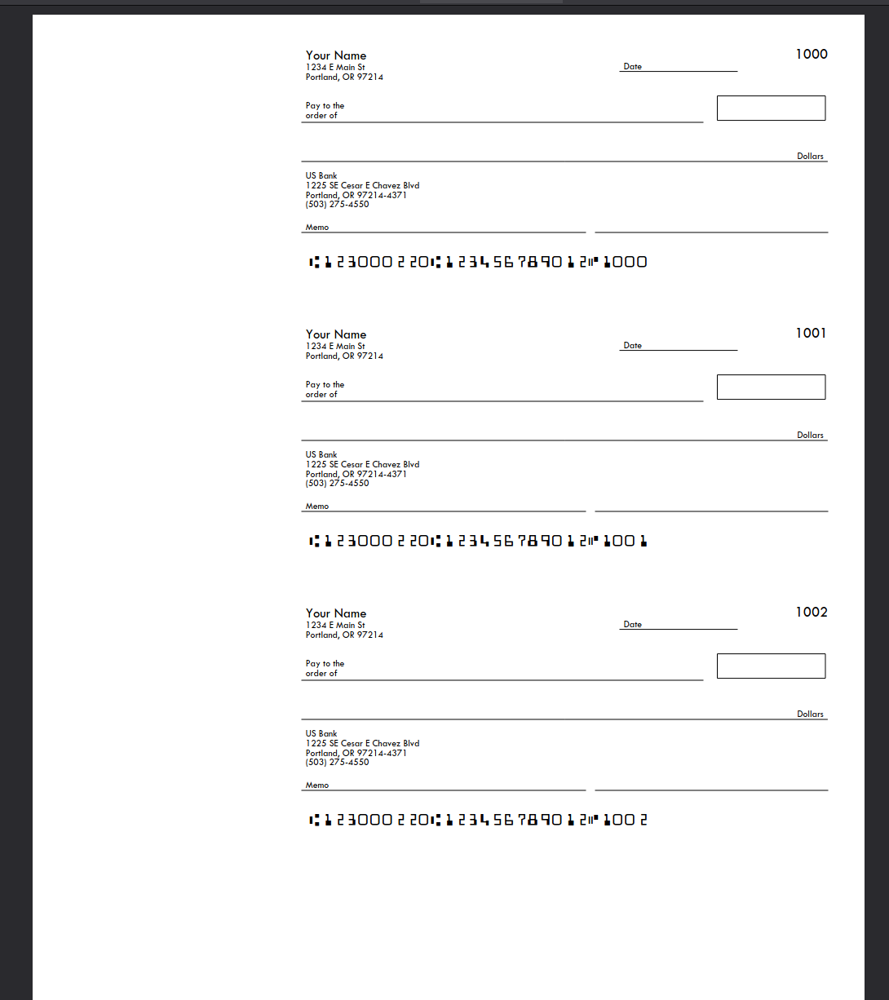
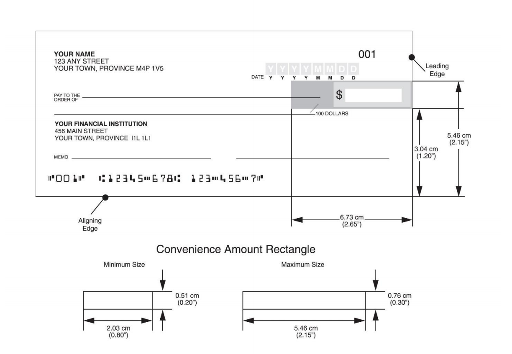
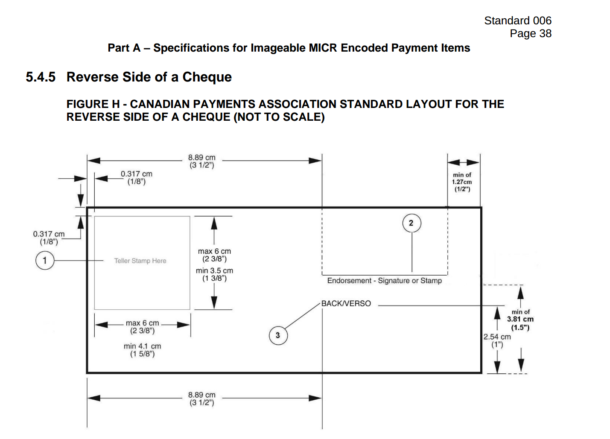

# Cheques
## Background
Welcome to Canada's ancient banking system.  

Cheques are not as secure as people think - all someone needs to draw money from your account is the magic 3 numbers used for direct deposits - institution number, transit number and account number.

Cheque stock is also not controlled like currency paper stock is, so any Joe Schmo can create cheques.

If you want to send >3-10K from/to an account, you need a cheque unless you want to pay $100 in wire fees on both ends or go to a branch and order a draft for ~$10.

Go in person and have to pay? How about no?

With this method, you can print your own cheques for an unlimited number of accounts and deposit them via your bank's mobile app so you don't need to leave your house.
## Features

### Canada Full Size
> WIP
- Fits amounts up to $9,999,999.99 in legal field. Technically cheque limits in Canada are 25M, but I would use a draft...


### Canada Wallet  


### US Wallet ✅  

Used since at least 2005 according to the original author. https://github.com/aaronpk/checks

## WARNING

> ONLY PRODUCE CHEQUES FOR YOUR OWN ACCOUNTS!

### Forgery (Section 366 of the Criminal Code)
#### Making or altering a cheque with intent to defraud.
- Indictable offense: Up to 10 years in prison
- Summary conviction: Lesser penalties such as fines or up to 2 years less a day in jail.

### Uttering a Forged Document (Section 368 of the Criminal Code)
#### Knowingly using a fraudulent cheque.  
- Indictable offense: Up to 10 years in prison
- Summary conviction: Lesser penalties.

### Fraud (Section 380 of the Criminal Code)
#### If the fraud amount exceeds $5,000, it can result in:
- Up to 14 years in prison
- Restitution orders (repayment of defrauded funds)
- A criminal record that can affect future employment and travel.

### Don't do it!

## Design

Spec:  
https://www.payments.ca/sites/default/files/standard006eng.pdf



MICR 


## Installing
### Ubuntu
```bash
sudo apt install php-cli
```

## Running
```bash
php -S 127.0.0.1:8000
```

### Routes
- Canada Full Size
    - http://127.0.0.1:8000
- Canada Wallet
    - http://127.0.0.1:8000/can-wallet.php
- US
    - http://127.0.0.1:8000/us.php


## Canadian Cheque Paper
Make sure the paper you buy has the Canadian endorsement pre-printed text and not the US ones.

The cheapest I've found as of writing in 2025 is $86 shipped for 500 sheets, with 3 cheques per sheet is 1500 cheques. I think I wikl retire before I use all of them!

The minimum size of a cheque is now 6.25" wide and 2.75" high. The maximum size of a cheque is now 8.5" wide by 3.75" high.

The bottom 5/8" (called the MICR Clear Band) must be clear of all printing except for the magnetic ink numbers and symbols. There should be no background printing in the MICR clear band, and if there is it must be so light that it will not interfere with readability when the cheque is scanned.

Canadian Cheque ✅  


US Check ❌  


## Depositing
If you have a laser printer and can buy magnetic (MICR) ink, the cheques will work pretty much everywhere.

If you print this out with a regular inkjet or laser printer, some ATMs don't accept them, but otherwise work as normal. 

Most cheques are scanned via optical methods (camera phone on mobile bank deposit, or inside ATMs), so you shouldn't have a problem with non-magnetic ink. Legally, a cheque doesn't have to have magnetic ink, it was just historically the best way for machines to scan the routing and account number.

CPA 006 in 2006 standardized cheques because banks were no longer sending them to each other, but cheque images are transmitted  electronically which gave the rise to mobile deposit features.

https://www.asap-cheques.com/questions/cpa-006/cpa-006-overview-introduction
